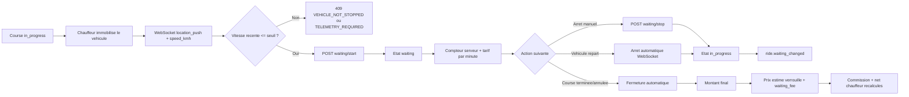

# Graphify - SCRUM-205 Mode attente

**Date :** 2026-09-21

**Etat :** livre sur `dev` et `stage`

**Contrat :** DiddiGo API v3.4



## Carte du milestone

| Axe | Resultat |
|---|---|
| Use case | Le chauffeur facture une attente uniquement lorsque le vehicule est arrete |
| Source d'autorite | DiddiGo calcule timestamps, duree et montant |
| Etat ajoute | `waiting` |
| REST | `POST /v1/rides/{id}/waiting/start` et `/waiting/stop` |
| WebSocket entrant | `driver.location_push.speed_kmh` |
| WebSocket sortant | `ride.status_changed`, `ride.waiting_changed` |
| Stockage chaud | Redis, vitesse recente avec TTL |
| Stockage durable | PostgreSQL, duree et supplement cumules |
| Migration | `e6f7a8b9c0d1` |
| Tarif par defaut | 100 XOF/min, configurable |
| Regle d'arrondi | Toute minute commencee est facturee, minimum une minute par periode |
| Prix final | Prix estime verrouille + supplement d'attente |
| Tests | 276 passes |
| Jira | `SCRUM-205` termine |
| Git stage | `4622ad2` |
| Git dev | `d1616e0` |

## Configuration

```env
WAITING_PRICE_PER_MINUTE_XOF=100
WAITING_STATIONARY_SPEED_THRESHOLD_KMH=3
WAITING_TELEMETRY_TTL_SECONDS=30
```

## Parcours frontend

```text
Chauffeur : course -> arret -> attente -> compteur -> reprise
Passager  : course -> attente visible -> supplement visible -> reprise -> prix final
Reconnexion : GET /v1/rides/{id} restaure l'etat courant
```

## Garde-fous

- Le frontend ne fournit jamais la duree, le prix ou les timestamps.
- Une telemetrie absente ou perimee bloque l'activation.
- Une reprise de mouvement arrete automatiquement l'attente.
- Le `PATCH` generique ne peut pas contourner `/waiting/stop`.
- Terminer ou annuler une course ferme d'abord l'attente active.

## Suite liee

- `UC-258` : finaliser l'affichage passager du prix compose.
- Activation automatique apres immobilisation prolongee : hors de ce milestone.
